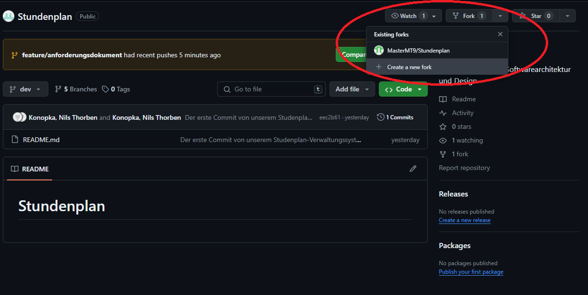

# Stundenplan

## Wie arbeite ich an dem Projekt?

Um effektiv mit Github zu arbeiten, benutzen wir Forks und Pull Requests.

Mithilfe eines Forks kann man ein Repository klonen und Lokal berarbeiten. Die getätigten Ändereungen können via Pull-Request auf dem Hauptrepository hinzugefügt werden.

## Wie erstelle ich einen Fork auf Github?

Um einen Fork zu erstellen, kann auf der Github-Seite des Repositorys der Fork-Buttton betätigt werden.

Nach erfolgreichen Fork des Repositories kann nun das Repository geklont werden. Hierzu kann via SSH oder HTTPS das Repository geklont werden.
Für das Aufsetzen eines SSH-Clients und der Erzeugung von SSH-Keypairs gibt es Ausreichen Tutorials im Internet, falls SSH auf der Maschine bereits konfiguriert ist, kann unter https://github.com/settings/keys der Public Key hinterlegt werden.

 

Wenn Git Lokal installiert ist, kann nun Mithilfe des Befehls ``git clone [Kopierte Adresse aus Clone-Fenster]`` im aktuellen Verzeichnis das Repository Lokal geklont werden.

Nachdem alle gewünschten Anpassungen getätigt wurden, muss auf das eigene Repository gepushed werden.

Wenn das Repository up-to-date ist, kann nun ein Pull-Request auf dem Hauptrepository getätigt werden. Via "compare across forks" kann nun das Hauptrepository mit dem Fork verglichen werden und ein Pull-Request erstellt werden. Sobald jemand anderes den Pull-Request reviewed hat, kann ein Merge getätigt werden, welche die Änderungen auf das Haupt-Repository zieht.